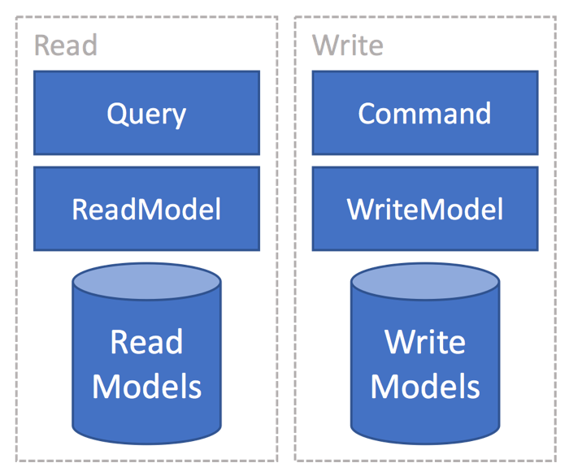
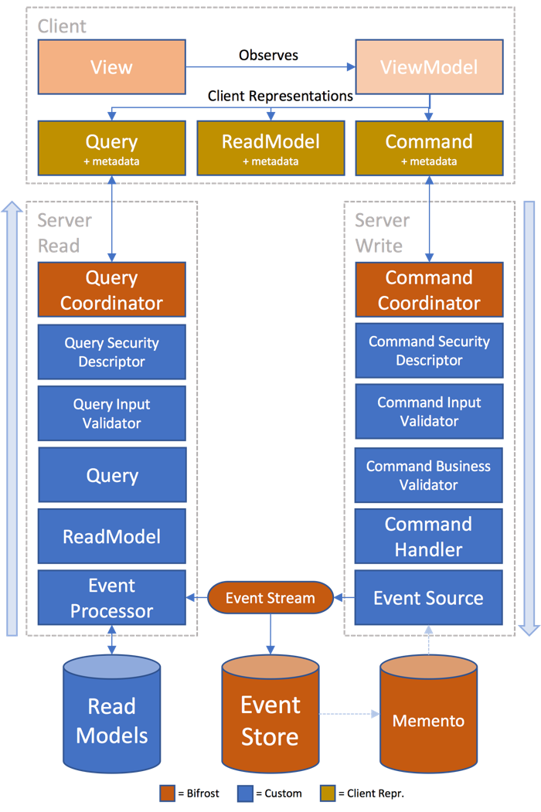

# Overview

Bifrost targets the line of business type of application development. In this space there are very often requirements that
are somewhat different than making other types of applications. Unlike creating a web page with content, line of business
applications has more advanced business logic and rules associated with it. In addition, most line of business applications
tend to live for a long time once they are being used by users. Big rewrites are often not an option, as it involves a lot of
work to capture existing features and domain logic in a new implementation. This means that one needs to think more
about the maintainability of the product. In addition to this, in a fast moving world, code needs to built in a way that
allows for rapidly adapting to new requirements. It truly can be a life/death situation for a company if the company is
not able to adapt to market changes, competitors or users wanting new features. Traditional techniques for building software
have issues related to this. N-tier architecture tends to mix concerns and responsibilities and thus leading to
software that is hard to maintain. According to [Fred Brooks](https://en.wikipedia.org/wiki/Fred_Brooks) and
["The Mythical Man-Month"](https://en.wikipedia.org/wiki/The_Mythical_Man-Month), 90% of the cost
related to a typical system arise in the maintenance phase. This means that we should aim towards building our systems
in a way that makes the maintenance phase as easy as possible.

The goal of Bifrost is to help make this better by focusing on bringing together good software patterns and practices,
and sticking to them without compromise. Bifrost embraces a set of practices described in this article and aims to adhere
to them fully.

## History

The project got started in late 2008 with the first public commits going out to Codeplex in early 2009. Source control History
between 2009 and 2012 still sits [there](http://bifrost.codeplex.com). In 2012 it was moved to [GitHub](https://github.com/dolittle/bifrost).
From the beginning the project evolved through the needs we saw when consulting for different companies. Amongst these were [Komplett](https://www.komplett.no).
A presentation @ NDC 2011 showcases the work that was done, you can find it [here](https://vimeo.com/45594255).
From 2012 to 2015 it got further developed @ Statoil and their needs for a critical LOB application; ProCoSys.
The result of this is that Statoil continued the work and created their own [fork](https://github.com/ProCoSys/Bifrost)
and have gone their own path with it and use it on the ProCoSys project on a day to day basis.

## Domain Driven Design

Bifrost got from the beginning set to embrace [Domain Driven Design](https://en.wikipedia.org/wiki/Domain-driven_design) and
its concepts from. The reason for this is that part of modelling a system is understanding the domain that the system is targetting and
understanding the vocabulary used by the domain experts in that domain and then be able to model exactly this.
DDD is all about getting to a ubiquitous language that all team members use and understand.

### Bounded context

In a large system you find that the system is not a single monolithic system, but rather a composition of smaller systems.
Rather than modelling these together as one, bounded contexts play an important role in helping you separate the different
sub systems and modelling these on their own. Putting it all together in one model tends to become hard to maintain over
time and often error prone due to different requirements between the contexts that has yet to be properly defined.
We see that we often have some of the same data across a system and chose to model this only once - making the model
include more than what is needed for specific purposes. This leads to bringing in more data than is needed and becomes
a compromise. Take for instance the usage of [Object-relational mapping](https://en.wikipedia.org/wiki/Object-relational_mapping)
and a single model for the entire system approach. If you have a model with relationships and you in reality have different
requirements you end up having to do a compromise of how you fetch it. For instance, if one your features displays all
the parts of the model including its children; it makes sense to eagerly fetch all of this to save roundtrips. While if
the same model is used in a place where only the top aggregate holds the information you need, you want to be able to
lazy load it so that only the root gets loaded and not its children. The simple solution to this is to model each of the
models for the different bounded contexts and use the power of the ORM to actually map to the database for the needs one
has.

The core principal is to keep the different parts of your system apart and not take any dependency on any other contexts.

### Context map

At times bounded contexts needs a certain awareness of other contexts. This is often related to data and things that
the certain context does not own, but needs a relationship to. A context map can then provide a bridge between the
contexts. This is something that is modelled directly.

> [!Note]
> As of December 2016, Bifrost does not have a mechanism for this.
> It is under investigation in Issue [#684](https://github.com/dolittle/Bifrost/issues/684)

### Building blocks

Domain Driven Design provides a set of building blocks to be able to model the domain. Bifrost aims to include most of these
building blocks as long as it makes sense.

#### Value Object

A value object is an object that contains attributes but has no conceptual identity. They should be treated as immutable.
In Bifrost you'll find the [concept](../Backend/concepts.md) value object as a good example. Value objects does not hold
identity that make them unique in a system. For instance multiple persons can live on the same address, making the address
a great candidate for a value object as it is not a unique identifier.

#### Aggregate

Aggregates represents a collection of objects that are bound together to form a root entity. In Bifrost you'll find the
[AggregateRoot](../Backend/aggregate_root.md) that represents this. Important aspect of the aggregate in Bifrost is
however that it does not expose any public state, whatever entities it relies on should only be used internally to
be able to perform business logic. The ``AggregateRoot``is also what is known as an [EventSource](../Backend/Events/event_sourcing.md).

### Entity

Entities are the artifacts that aggregates can use to form the root entity. They are uniquely identified in the system.
For [aggregate roots](../Backend/aggregate_root.md) in Bifrost, it is about modelling the business logic that belong together.

> [!Note]
> As of December 2016, Bifrost does not have a specific construct for this
> It is under investigation in Issue [#685](https://github.com/dolittle/Bifrost/issues/685)

#### Repository

The repository pattern is all about providing an abstraction for working with domain objects and be storage agnostic, but focused
around the needs of the domain model.
Since Bifrost is built around the concept of [CQRS](https://en.wikipedia.org/wiki/Command–query_separation#Command_Query_Responsibility_Segregation),
the domain repository is one that knows how to work with [aggregate roots](../Backend/aggregate_root.md).

#### Service

When operations conceptually does not belong to the domain object, you can pull in supporting services.
These are not something the aggregate knows about, but something that knows about both and coordinates it.
In Bifrost this would be the [CommandHandler](../Backend/Commands/command_handler.md)

#### Domain Events

Important part of modelling the domain are the [domain events](../Backend/Events/introduction.md). These are the things
the domain experts talk about, the consequences, the things that happens in the system. Domain events represents the actual
state transitions in a system. The [AggregateRoot](../Backend/aggregate_root.md) is the place where events are produced.

## SOLID

The [SOLID principles](https://en.wikipedia.org/wiki/SOLID_(object-oriented_design)) aims to make it easier to create more maintainable software.
It has been the core principles at play from the beginning of Bifrost.
Below is a quick summary and some relations into Bifrost.

### Single Responsibility Principle

Every class should have a single responsibility.

### Open / Closed Principle

Systems and its entities should be open for extension, but closed for modification.
A good examples of this is how you can extend your system quite easily by just putting in new [event processor](../Backend/Events/event_processor.md)
without having to change the internals of Bifrost.

### Liskov Substition Principle

Objects in a program should be replacead with instances of their subtypes without altering the correctness of that program.
An example of how Bifrost follows this is for instance the [event store](../Backend/Events/event_store.md) works.
It has multiple implementations and the contract promises what it can do, implementations need to adhere to the contract.

### Interface Segregation Principle

Interfaces should represent a single purpose, or concerns. A good example in .NET would be ``IEnumerable`` and ``ICollection``.
Where ``IEnumerable`` concerns itself around being able to enumerate items, the ``ICollection`` interface is about modifying
the collection by providing support for adding and removing. A concrete implementation of both is ``List``.

### Dependency Inversion Principle

Depend on abstractions, not upon the conrete implementations.
Rather than a system knowing about concrete types and taking also on the responsibility of the lifecycle of its dependencies.
We can quite easily define on a constructor level the dependencies it needs and let a consumer provide the dependencies.
This is often dealt with by introducing an [IOC](https://en.wikipedia.org/wiki/Inversion_of_control) container into the system.
Bifrost is built around this principle and relies on all dependencies to be provided to it.
It also assumes one has a container in place, read more [here](../Backend/container.md).

## Seperation of Concerns

Another part of breaking up the system is to identify and understand the different concerns and separate these out.
An example of this is in the frontend, take a view for instance. It consists of flow, styling and logic. All these are
different concerns that we can extract into their own respective files and treat independently; HTML, CSS, JavaScript.
Other good examples are validation, instead of putting the validation as attributes on a model in C# - separate these into their
own files like [Bifrost enforces](../Backend/validation.md).

Read more in details about it [here](https://en.wikipedia.org/wiki/Separation_of_concerns).

## Decoupling & Microservices

At the heart of Bifrost sits the notion of decoupling. Making it possible to take a system and break it into small focused lego pieces
that can be assembled together in any way one wants to. This is at the core of what is referred to as
[Microservices](https://en.wikipedia.org/wiki/Microservices). The ability to break up the software into smaller more digestable components
that makes our software in fact much easier to understand and maintain. When writing software in a decoupled manner, one gets the
opportunity of composing it back together however one sees fit. You could compose it back in one application running inside a single
process, or you could spread it across a cluster. It really is a deployment choice once the software is giving you this freedom.
When it is broken up you get the benefit of scaling each individual piece on its own, rather than scaling the monolith
equally across a number of machines. This gives a higher density, better resource utilization and ultimately better cost
control. With all the principles mentioned in this article, one should be able to produce such a system and that is what
Bifrost aims to help with.

### Discovery

Bifrost is heavily relying on different types of discovering mechanisms.
For the C# code the discovery is all about types. It relies on being able to discover concrete types, but also implementations of interfaces.
Through this it can find the things it needs. You can read more about the type discovery mechanism [here](../Backend/type_discovery.md).
It automatically knows about all the assemblies and the types in your system through the [assembly discovery](../Backend/assembly_discovery.md)
done at startup.

## Cross Cutting Concerns

When concerns are seperated out, some of these can be applied cross cuttingly. [Aspect-oriented programming](https://en.wikipedia.org/wiki/Aspect-oriented_programming)
is one way of applying these. Other ways could be more explicitly built into the code; something that Bifrost enables.
The point of this is to be able to cross-cuttingly enforce code. Things that typically are repetitive tasks that a developer needs
to remember to do are good candidates for this. It could also be more explicit like the [security descriptors](../Backend/security_descriptor.md)
in Bifrost that enables one to declaratively set up authorization rules across namespaces for instance.
This type of thinking can enable a lot of productivity and makes the code base less errorprone to things that needs to be remembered,
it can be put in place one time and one can rely on it. Patterns like [chain-of-responsibility](https://en.wikipedia.org/wiki/Chain-of-responsibility_pattern)
can help accomplishing this without going all in on AOP.

## Conventions over Configuration

For a team to deliver consistency in the codebase, one should aim for a recipe that makes it easy to the right thing and
hard to the wrong thing. Having conventions to govern the recipe forces the team to deliver in one way. Bifrost is highly
focused around the concept of conventions in place for things, rather than having to configure thing. The conventions instead
are configurable. Since things are discovered and one does not need to configure everything, we adhere more easier to the
Open / Closed principle as mentioned earlier. Meaning that we don't have to open up code to get new things in place, it will
be discovered by how the conventions are and configured.

The simplest example of a convention in play in Bifrost is during initialization, Bifrost will configure whatever [IOC container](https://en.wikipedia.org/wiki/Inversion_of_control)
you have hooked with conventions. One default convention plays a part here saying that an interface named ``IFoo``will be bound to ``Foo``
as long as they both sit in the same namespace. You'll see this throughout Bifrost internally as well, for instance ``ICommandCoordinator`` is 
bound to ``CommandCoordinator``.

Other good examples of conventions in Bifrost is in the Web frontend where one can specify a particular *View* to be loaded and it will
automatically look for a *ViewModel* with the same name but instead of *.html* as extension, it looks for *.js*.

The conventions at play are described throughout the documentation when it is relevant.

## Automated testing

Part of being able to move fast with precision is having a good automated test regime. One that runst fast and can be relied upon for avoiding
regressions. Bifrost was built from day one with automated tests, or rather Specs - specifications. You can read more about how Bifrost
does this [here](contributing.md).

## CQRS

Most systems has different requirements for the read and the write part of each bounded context. The requirements vary on what is
needed to be written in relation to what is being read and used. The performance characteristics are also for the most part different.
Most line-of-business applications tend to read a lot more than they write. [CQRS](https://en.wikipedia.org/wiki/Command–query_separation#Command_Query_Responsibility_Segregation)
talks about totally segregating the read from the write and treat them uniquely.
One finds [event sourcing](../Backend/Events/event_sourcing.md) often associated with CQRS, something that Bifrost has embraced and helps
bridge the two sides and stay completely decoupled.

## Model View View Model

MVVM is a variation of [Martin Fowler's](https://en.wikipedia.org/wiki/Martin_Fowler) [Presentation Model](http://martinfowler.com/eaaDev/PresentationModel.html).
Its the most commonly used pattern in XAML based platforms such as WPF, Silverlight, UWP, Xamarin and more.

### Model

The model refers to state being used typically originating from a server component such as a database.
It is often referred to as the domain model. In the context of Bifrost, this would typically be the [ReadModel](read_model.md).

### View

The view represents the structure and layout on the screen. It observes the ViewModel.

### ViewModel

The ViewModel holds the state; the model and also exposes behaviors that the view can utilize.
In XAML the behaviors is represented by a [command](https://msdn.microsoft.com/en-us/library/system.windows.input.icommand(v=vs.110).aspx),
something that wraps the behavior and provides a point for execution but also the ability to check wether or not
it can execute. This proves very handy when you want to validate things and not be able to execute unless one is valid or is authorized.
Bifrost has the concept of commands, these are slightly different however. In fact, commands in Bifrost is a part of the domain.
It is the thing that describes the users intent. You can read more about them [here](../Backend/Commands/introduction.md).
In the Bifrost JavaScript frontend however, the type of properties found with the XAML platforms
can also be found here. Read more about the frontend commands [here](../Frontend/JavaScript/commands.md).

### Binding

Part of connecting the View with the ViewModel and enabling it to observe it is the concept of binding.
Binding sits between the View and the ViewModel and can with some implementations even understand when values change
and automatically react to the change. In XAML, this is accomplished through implementing interfaces like [INotifyPropertyChanged](https://msdn.microsoft.com/en-us/library/system.componentmodel.inotifypropertychanged(v=vs.110).aspx)
and [INotifyCollectionChanged](https://msdn.microsoft.com/en-us/library/system.collections.specialized.inotifycollectionchanged(v=vs.110).aspx)
for collections.

Bifrost have full client support for both XAML based clients and also for JavaScript / Web based.
For XAML and what is supported, read more in detail [here](../Frontend/XAML).
For the JavaScript support, Bifrost has been built on top of [Knockout](http://knockoutjs.com) that provides ``obervable()`` and ``observableArray()``.
Read more about the JavaScript support [here](../Frontend/JavaScript).

### Figures

A traditional MVVM would look something like this:

With the artifacts found in Bifrost and more separation in place with CQRS, the diagram looks slightly different

You can read more details about the MVVM pattern [here](https://en.wikipedia.org/wiki/Model–view–viewmodel).

## Cohesion

Rather than grouping artifacts by its technical nature; keep the things that are relevant to each other close.
This makes it easier to navigate and provides a more consistent structure than having to divide by technical nature.

Divide only by the tier the artifacts belong to. See Example below.

### Frontend (Web)

    +-- Bounded Context 1
    |   +-- Module 1
    |   +---- Feature 1
    |   |     | View.html
    |   |     | ViewModel.js
    |   |     | Styles.css
    |   |     | SomeRestAPI.cs
    |   |     | SomeSignalRHub.cs
    |   +---- Feature 2
    |   |     | View.html
    |   |     | ViewModel.js
    |   |     | Styles.css
    |   |     | SomeRestAPI.cs
    |   |     | SomeSignalRHub.cs
    +-- Bounded Context 2
    ...

### Domain

    +-- Bounded Context 1
    |   +-- Module 1
    |   +---- Feature 1
    |   |     | Command.cs
    |   |     | CommandInputValidator.cs
    |   |     | CommandBusinessValidator.cs
    |   |     | CommandHandler.cs
    |   |     | SecurityDescriptor.cs
    |   |     | CommandHandler.cs
    |   |     | AggregateRoot.cs
    |   |     | Service.cs
    |   +---- Feature 2
    |   |     | Command.cs
    |   |     | CommandInputValidator.cs
    |   |     | CommandBusinessValidator.cs
    |   |     | CommandHandler.cs
    |   |     | SecurityDescriptor.cs
    |   |     | CommandHandler.cs
    |   |     | AggregateRoot.cs
    |   |     | Service.cs
    +-- Bounded Context 2
    ...

### Event

    +-- Bounded Context 1
    |   +-- Module 1
    |   +---- Feature 1
    |   |     | Event.cs
    |   +---- Feature 2
    |   |     | Event.cs
    +-- Bounded Context 2
    ...

### Read

    +-- Bounded Context 1
    |   +-- Module 1
    |   +---- Feature 1
    |   |     | ReadModel.cs
    |   |     | Query.cs
    |   |     | QueryValidator.cs
    |   |     | SecurityDescriptor.cs
    |   |     | AggregateRoot.cs
    |   |     | Service.cs
    |   +---- Feature 2
    |   |     | ReadModel.cs
    |   |     | Query.cs
    |   |     | QueryValidator.cs
    |   |     | SecurityDescriptor.cs
    |   |     | AggregateRoot.cs
    |   |     | Service.cs
    +-- Bounded Context 2
    ...

## Full Pipeline

Below is the full pipeline of Bifrost when utilizing all its capabilities.

## Conclusion

This article described all the principles that has played a key role in building Bifrost and will remain key to the future development of
Bifrost. The focus is to be able to break things into the smallest of problems and be very explicit about it.
This gives you the freedom of chosing how to deploy your software. If you're starting out with something new, you might now have the
luxury of running it scaled out in any way; nor should you, after all you don't know how it will be responded to in the market - nor
do you know the performance characteristics of your system, therefor you should probably just deploy it in such a way that it runs
as a single process on a single server and scale out when needed. It is all about providing the capability when needed, build the
system in a way that makes this possible. This is what Bifrost aims at making simple without compromise.
