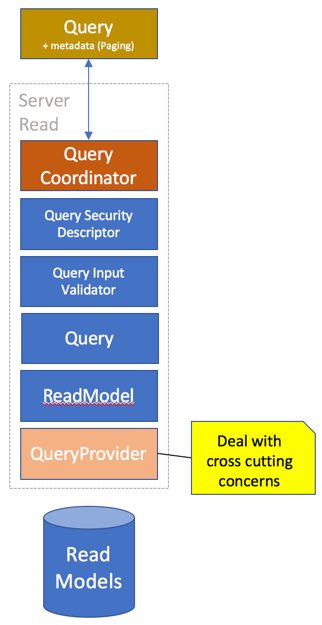

# Queries

Bifrost has formalized queries into types. These types are then your contracts
for your query capabilities. These queries can be as optimized for the
datasource as you see fit for the feature they're being used in.

## QueryFor

To implement a query, you basically need to implement the interface `IQueryFor<>`.
The generic type argument should point to a [read model](read_model.md).
This is a marker interface and does not require you implement anything specific.
Instead it is relying on a convention; its looking for a property called `Query`.
This property needs a getter and can effectively return any type. The type that it
returns is recognized by Bifrost and Bifrost will look for a [query provider](query_providers.md)
for the type returned. By default you could be returning an `IQueryable<>` - something
Bifrost has a [query provider](query_providers.md) for.


```csharp
using Bifrost.Read;

public class AllEmployees : IQueryFor<Employee>
{
    public IQueryable<Employee> Query { get {....} }
}
```

The implementation of the query can be anything you want it to be. Use whatever
underlying datastore and technique to get to the data. The only rule is that there
must be a [query provider](query_providers.md) for the return type.

Bifrost has a very simple [repository for read models](read_model_repository.md) that
can be used.

### Arguments

With queries, sometimes you need to filter based on input. Any public property with
a getter and a setter is considered an argument for the query.

These can then be part of your query.

```csharp
using Bifrost.Read;

public class EmployeesHiredAfter : IQueryFor<Employee>
{
    IReadModelRepositoryFor<Employee> _repository;

    public EmployeesHiredAfter(IReadModelRepositoryFor<Employee> repository)
    {
        _repository = repository;
    }

    public DateTime HiredAfter { get; set; }

    public IQueryable<Employee> Query => _repository.Query.Where(e => e.HiredDate >= HiredAfter);
}
```


## Validation

The arguments can have validators associated with them. All you need to do is to create something
that inherits from `QueryValidationDescriptorFor<>` and point the generic argument to the
query type.

```csharp
using Bifrost.Validation;
using Bifrost.Read.Validation;

public class EmployeeHiredAfterValidator : QueryValidationDescriptorFor<EmployeesHiredAfter>
{
    public EmployeeHiredAfterValidator()
    {
        // Require that hiring date is set after a certain date
        ForArgument(e => e.HiredAfter).HasToBeGreaterThan(new DateTime(1985,1,1));
    }
}
```

## Paging

Paging is not something you need to think about. This is what the [query provider](query_provider.md)
deals with. Paging is a frontend concern and should not something you need to think about.
In fact, paging is ideally a view concern, something decided as part of the interaction design.
The client representations of queries has functionality related to paging.

## Filtering

Some features require filtering the read models on a model level. This could for instance be
row level security with complex scenarios making it easier to do it as a post process after
data has been received from the datasource.

Bifrost has a global mechanism for filtering.

```csharp
using System.Collections.Generic;
using System.Linq;
using Bifrost.Read;

public class MyReadModelFilter : ICanFilterReadModels
{
    public IEnumerable<IReadModel> Filter(IEnumerable<IReadModel> readModels)
    {
        var result = new List<IReadModel>();
        foreach( var readModel in readModels )
        {
            if( readModel is Employee && ((Employee)readModel).HiredAfter > new DateTime(1985,1,1) )
                result.Add(readModel);
        }
        return result;
    }
}
```

> [!Note]
> This solution is not optimal and will be implemented differently as described [here](https://github.com/dolittle/Bifrost/issues/784).

## Security

You secure the read models by adding a security descriptor, similar to how one does with validation in
a fluent way.

```csharp
using Bifrost.Security;

public class QuerySecurity : BaseSecurityDescriptor
{
    public QuerySecurity()
    {
        When
            .Fetching()
                .ReadModels()
                    .InNamespace(
                        typeof(Employee).Namespace,
                        s => s.User()
                                .MustBeInRole("ReadAccess"));
    }
}
```

> [!Note]
> Support for securing specific read models is on the way. Read more [here](https://github.com/dolittle/Bifrost/issues/786).

## Proxy Generation

All queries written in C# has a JavaScript counterpart when using the proxying.
Read more about proxy generation [here](../../Frontend/proxy_generation.md).

## QueryResult

At the top of the pipeline sits the `QueryCoordinator`, this will execute the query and return a
`QueryResult`object.

| Property         | Type                    | Description                                         |
| ---------------- | ----------------------- | --------------------------------------------------- |
| Items            | `IEnumerable`           | Contains the items                                  |
| TotalItems       | `Integer`               | Total number of items returned                      |
| QueryName        | `Boolean`               | Name of the query                                   |
| Exception        | `Exception`             | If there was an exception, this holds the exception |
| SecurityMessages | `IEnumerable<string>`   | Contains any messages from volated security rules   |
| Validation       | `QueryValidationResult` | Validation details related to the query             |
| PassedSecurity   | `Boolean`               | True if passed security                             |
| Success          | `Boolean`               | True if considered successful                       |
| Invalid          | `Boolean`               | True if not considered successful                   |


## Query provider - Extension point

```csharp

```

## Pipeline




