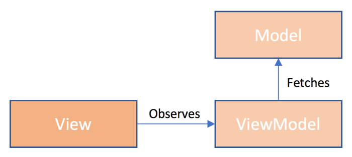

# Introduction

## MVVM

The Bifrost frontend is focused on the MVVM - Model View ViewModel approach.



This basically says that the view observes a view model, which exposes state typically as observables that can be reacted to in the view. The state is often something that is provided from the serverside and is called a model.

## Knockout

Bifrost is built on top of [KnockoutJS](http://knockoutjs.com) and providing extensions to simplify things.

One extension that is built is the ability to compose views together, read more [here](views.md).

### observableQueryParameter

You can easily observe query parameters and fall back to a default value, if the parameter is not present. If the parameter changes, typically without doing a full reload from the server - the value will act as any other Knockout observable.

```javascript
Bifrost.namespace("My.Namepace", {
    viewModel: Bifrost.views.ViewModel.extend(function() {
        this.observableValue = ko.observableQueryParameter("NameOfQueryParameter", "DefaultValue");
    })
})
```
