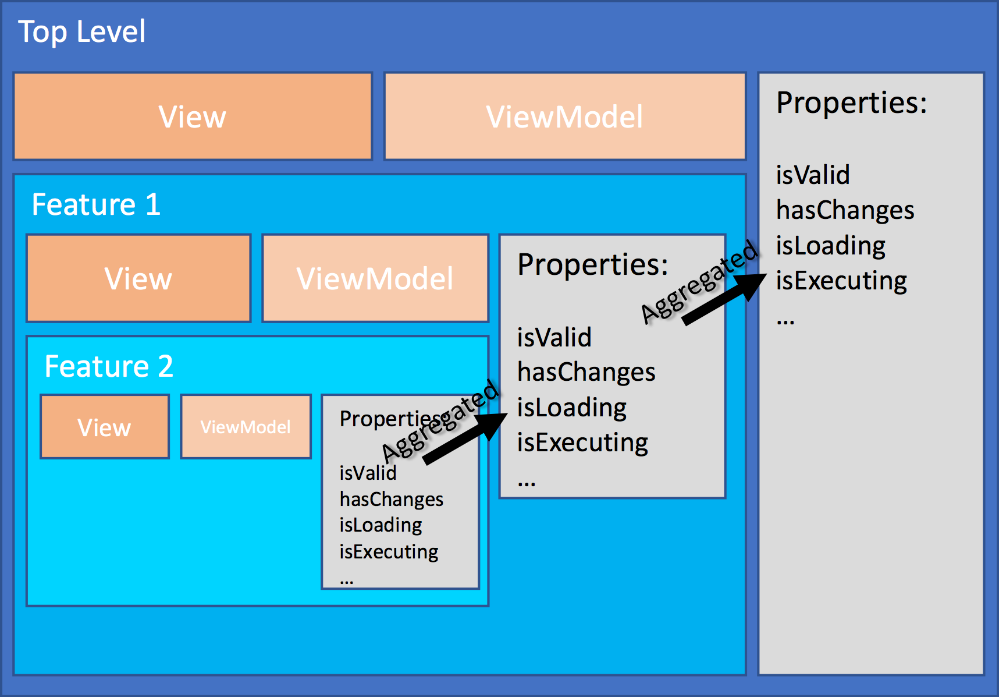

# Regions

Regions are at the center of the visual composition of the application.
A region is a logical grouping of a [view](views.md) and a [view model](view_models.md).
All regions are implicitly created during compositions, Bifrost manages creation and
lifecycle of them.



## Hierarchy

A region can have child regions. The region will be aware of any of the child
regions properties and respond to their changes recursively. This allows for checking
things like validation without having knowledge about the concrete different regions.
The region will aggregate information about what is going on in the region or any of
sub regions. Later in this article you'll see an overview of properties you can use
from the region.

## Inheritance

Regions are hierarchical by nature since a view can basically choose to include one or
more other views. Each of these views being referred to gets a region associated with it.
A view model is optional, but will by convention automatically be loaded and instantiated
and associated into the region.

Each region has a relationship to the parent region, not only through the parent property,
but also through inheritance. Regions inherit the parent region, making it possible to
access properties one wants to share at a higher level.

## Region Descriptors

Expanding a region with properties or functionality is done through what is known as a
region descriptor. This makes it possible to separate out this into its own concept.

```javascript
Bifrost.namespace("BoundedContext.Feature", {
    RegionDescriptor: Bifrost.views.RegionDescriptor.extend(function() {
        this.describe = function(region) {
            region.aCommonProperty = "Something";
        }
    })
});
```

## Operations

Bifrost has the concept of [operations](Interaction/operations.md). Basically an encapsulation
of work that the user wants performed. The operations are aggregated into the region they belong
to and when not executed represents a possible change.


## Properties

| Property                  | Type     | Observable | Description |
| ------------------------- | -------- | ---------- | ----------- |
| view                      | View     | X          | Holds the actual view for the region |
| children                  | Region[] | X          | Array of child regions |
| parent                    | Region   | X          | Parent region |
| isValid                   | Boolean  | X          | Returns validation related to any commands in the hierarchy |
| validationMessages        | String[] | X          | Array of any validation messages|
| canCommandsExwecute       | Boolean  | X          | Returns wether or not all the commands in the region or any sub region are capable of executing |
| areCommandsAuthorized     | Boolean  | X          | Returns wether or not all the commands in the region or any sub region are authorized |
| commandsHaveChanges       | Boolean  | X          | Returns wether or not any of the commands in the region or any sub region are authorized |
| areCommandsReadyToExecute | Boolean  | X          | Returns wether or not all the commands in the region or any sub region are ready to execute |
| hasChanges                | Boolean  | X          | Returns wether or not there are any commands with changes or any operations scheduled in the region or any sub region |
| isExecuting               | Boolean  | X          | Returns wether or not there are any commands in the region or any sub region executing |
| isComposing               | Boolean  | X          | Returns wether or not composition tasks in the region or any sub region is being performed |
| isLoading                 | Boolean  | X          | Returns wether or not there is a loading task running in the region or any sub region |
| isBusy                    | Boolean  | X          | An aggregate of isLoading, isComposing and isExecuting |
