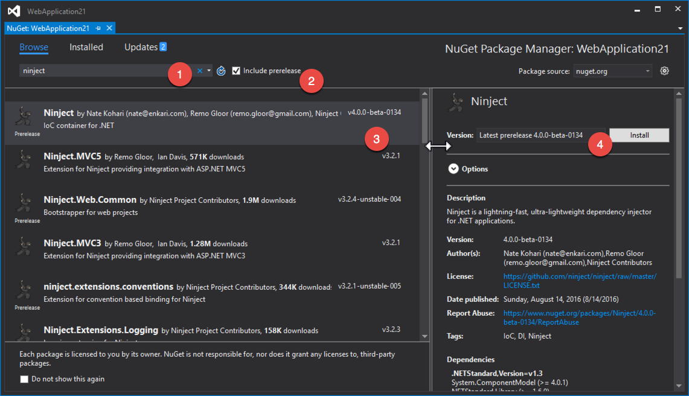
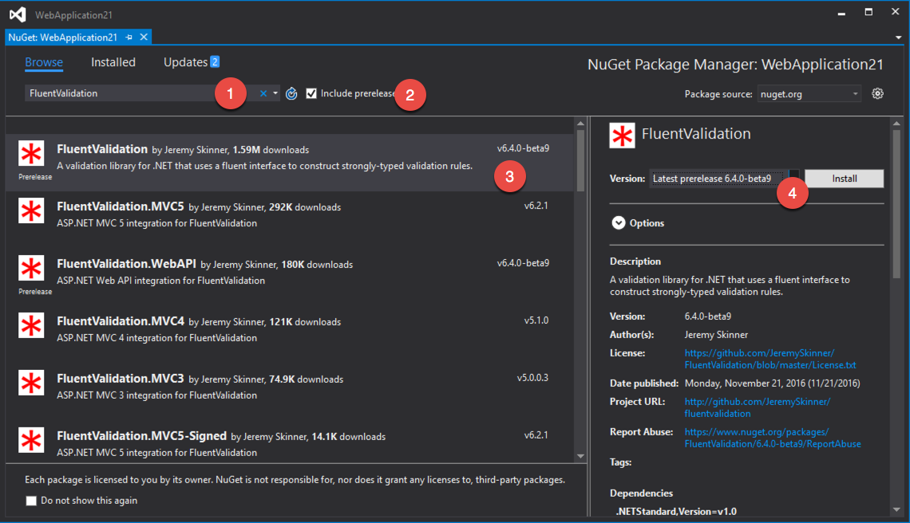
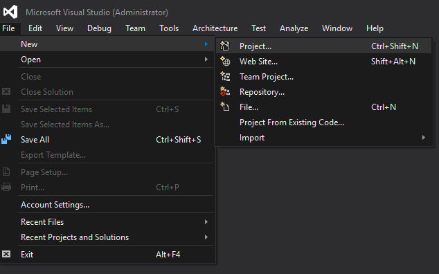
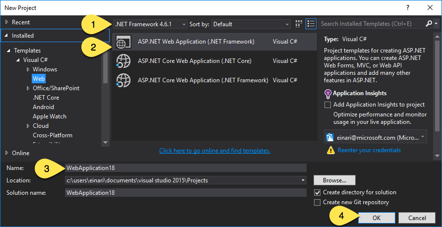
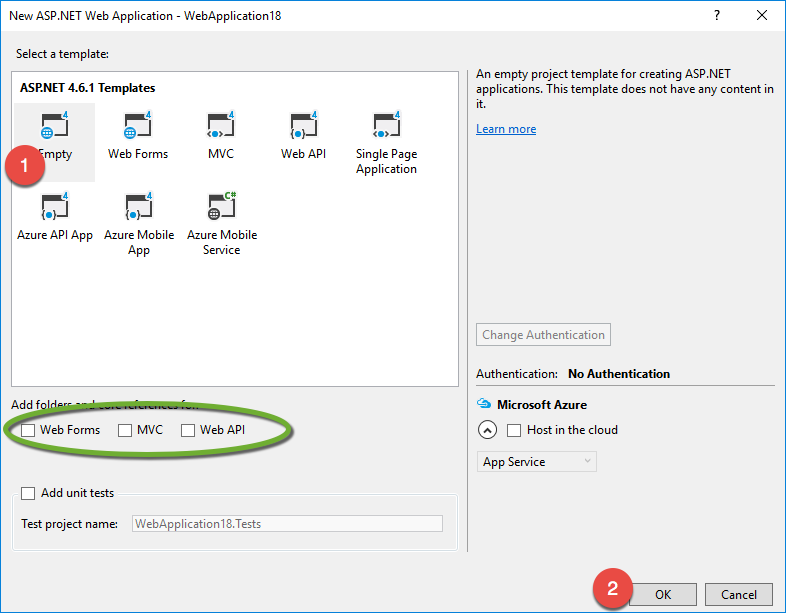
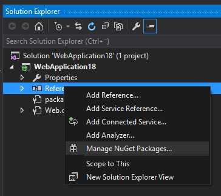
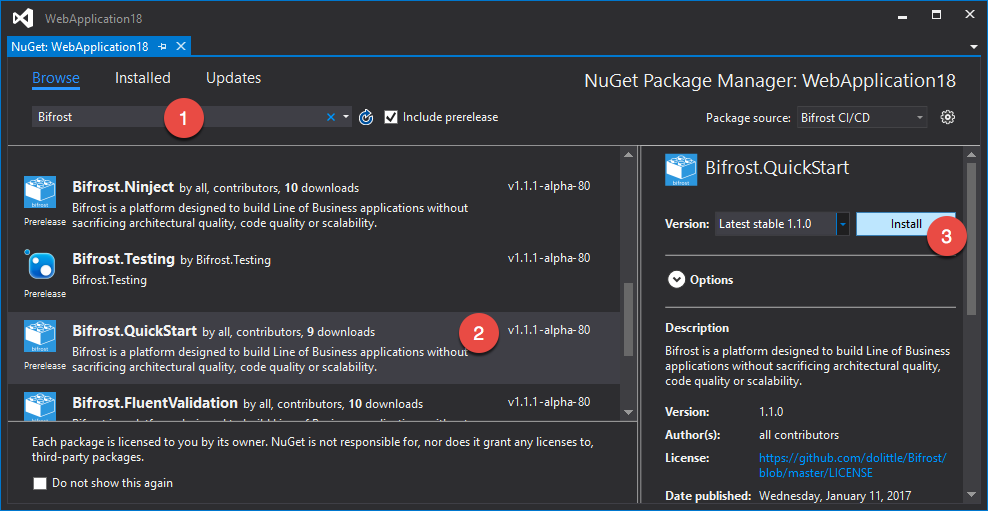
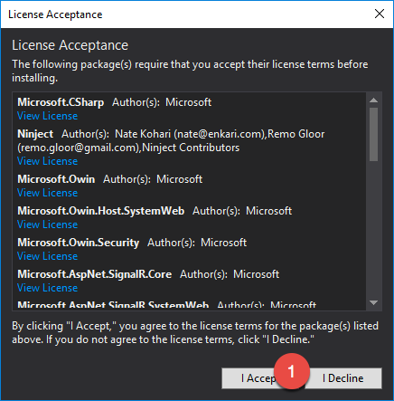
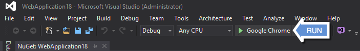
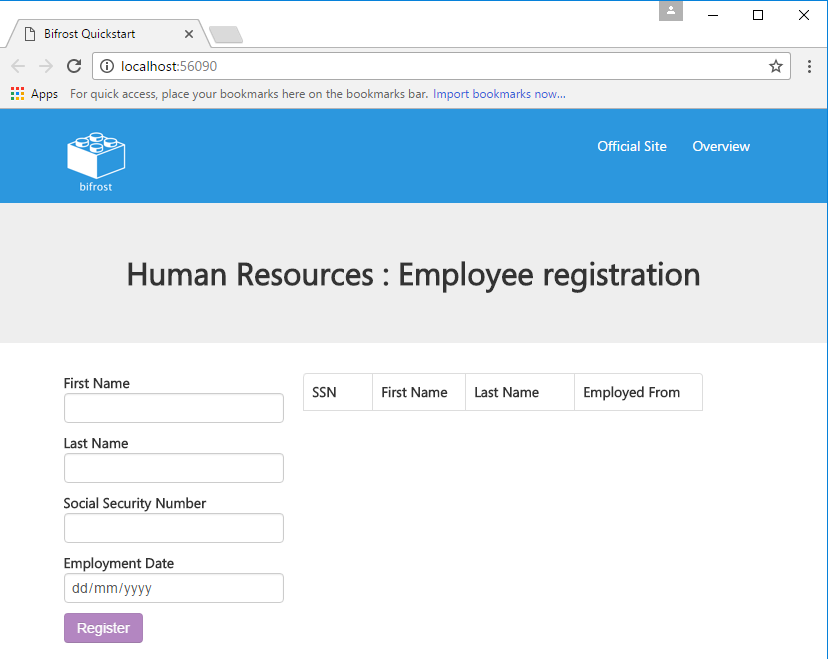

# QuickStart

The quickstart is a [NuGet](https://nuget.org) package that sets you with a sample building on Bifrost.
With the quickstart you get a Web based project that showcases Bifrost in an [end-to-end](end_to_end.md) scenario.

> [!Note]
> Bifrost is currently dependending on pre-release versions of some of its dependencies (Ninject & FluentValidation)
> Due to Bifrost being marked as a release package, NuGet inside Visual Studio will complain and not install correctly.
> This experience is not the same using the dotnet CLI and project.json.
>
> In order for you to get things running, you need to explicitly install the FluentValidation and Ninject parts before
> the quickstart package.
>
> 
>
> Or through the package manager console:
>
>```PowerShell
>    PM> Install-Package Ninject -version 4.0.0-beta-0134
>```
>
> 
>
> Or through the package manager console:
>
>```PowerShell
>    PM> Install-Package FluentValidation -version 6.4.0-beta-9
>```

## Step by Step

> [!Note]
> The quickstart has only been tested with [Visual Studio 2015](https://www.visualstudio.com),
> it might work with [Visual Studio for Mac](https://www.visualstudio.com/vs/visual-studio-mac/) as well.
> For [Visual Studio Code](https://go.microsoft.com/fwlink/?linkid=838612) and using
> .NET Core and project.json - it will restore all packages and you get to compile and
> run. But all the artifacts making up the sample is not put into the project folder.
> This tutorial focuses on the [Visual Studio 2015](https://www.visualstudio.com) experience.


* Start a new project:  


* Select .NET Framework 4.6.1 and ASP.NET Web Application, give it a name and click OK:  


* Select the Empty template:  


* Manage the NuGet packages for the project:  


* Browse / Search for Bifrost and find the latest QuickStart package and then click **Install**:  


* During installation it will ask you accept licenses, accept these:  


* You're now ready to run:  


* You should now see the following result:  


## Whats in the package

The package consists of configuration code and a sample running through the end to end of Bifrost.

### Configurator

The `Configurator.cs` file is the entrypoint that Bifrost is looking for to configure it all.
You can read more about how you can configure Bifrost [here](../Backend/configuration.md).

## ContainerCreator

The `ContainerCreator.cs` file is where the [IoC container](https://en.wikipedia.org/wiki/Inversion_of_control) is configured.
Bifrost is heavily relying on [dependency inversion](https://en.wikipedia.org/wiki/Dependency_inversion_principle). And has
been built from the ground up to rely on something providing these dependencies.

## Index

The `index.html` is the starting point of the application. Notice the following line:

```html
<div data-navigation-frame="home:HumanResources/Employees/index"></div>
```

It represents a navigation frame, explained in detail [here](../Frontend/JavaScript/navigation.md).

You can find the `home` view in which it is referring to in the `HumanResources/Employees`folder.
The viewModel for the view is automatically hooked up by convention. Read more about how views work [here](../Frontend/JavaScript/views.md).

### Packages

QuickStart depends on other Bifrost packages to get started. It has taken a few decisions for you and is also configured
in the simplest way that could possibly work.

The following packages has been pulled in:

| Package | Purpose |
| ------- | ------- |
| Bifrost | The core of Bifrost |
| Bifrost.JSON | JSON Serializer used throughout - utilizing [NewtonSoft.JSON](http://www.newtonsoft.com/json) |
| Bifrost.Ninject | Implementation for [Ninject](http://ninject.org/) - IoC container |
| Bifrost.FluentValidation | Implementation for validation using [FluentValidation](https://github.com/JeremySkinner/FluentValidation) |
| Bifrost.Web | The Web part - including the Bifrost JavaScript SPA framework |

