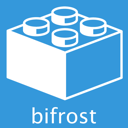

 

## Documentation can be found [here](https://dolittle.github.io/bifrost) - build status: 

Issues are being tracked for status over at [Huboard](https://huboard.com/dolittle/Bifrost/)

Bifrost is an application development framework promoting good development practices. 
The backend development is focused on CQRS (Command Query Responsibility Segregation) for promoting Domain Driven Design.

The fronted development is focused on MVVM (Model View ViewModel) for promoting better separation.

To get an idea of how the framework will help you get up and running fast, have a look here : http://vimeo.com/30971308

# Sponsors

# Site
For more details, samples, documentation, please go to the official [site](https://dolittle.github.io/bifrost)

# Contributing
Learn how you can contribute [here](https://dolittle.github.io/bifrost/Articles/contributing.html)
